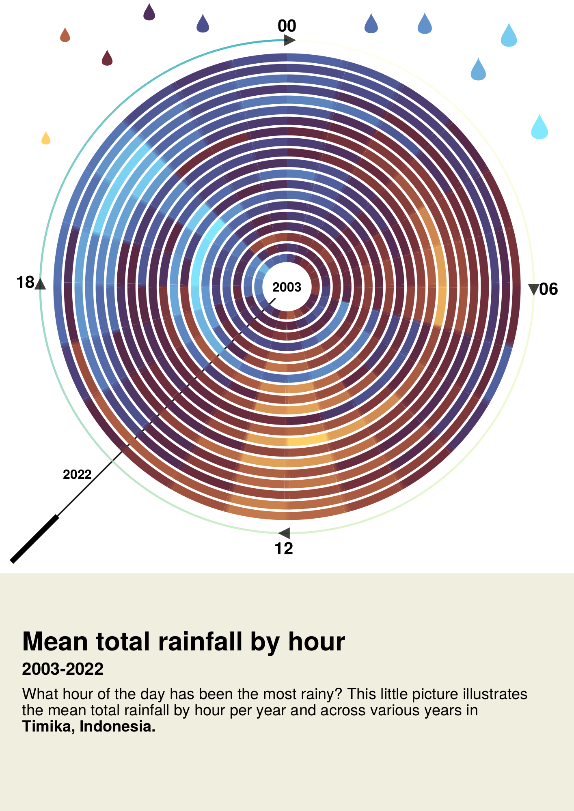

# Little Picture 2023
Little Pictures of climate

## Data:  [ERA5 hourly data](https://cds.climate.copernicus.eu/cdsapp#!/dataset/reanalysis-era5-single-levels?tab=overview) (ECMWF)

### Variable: tp, total precipitaion
The final data to generate these little pictures is included in this repository.

The data has been aggregated by initially selecting the city of interest and then spanning 0.25 degrees in each direction, resulting in a 0.5-degree pixel centered at the target city. The mean total precipitation is calculated across all days of the year for each hour, resulting in an array of 24 numbers per year.

Numerous small pictures were generated, most of which correspond to locations where rainfall persists throughout the year. Additional images could easily be generated.

---

  
   

---

  
   

### Weekly versions

  
   

---

  
   

---

### How to use this code?

If you have a julia installation then simply cloning/downloading this folder and [`instantiating`](https://pkgdocs.julialang.org/v1/environments/) the project will do. 

### License

These little pictures are published under **CC BY-SA 4.0 license**. The **code** is under the **MIT license**.

## Citation, ERA5 Data:

Hersbach, H., Bell, B., Berrisford, P., Biavati, G., Horányi, A., Muñoz Sabater, J., Nicolas, J., Peubey, C., Radu, R., Rozum, I., Schepers, D., Simmons, A., Soci, C., Dee, D., Thépaut, J-N. (2023): ERA5 hourly data on single levels from 1940 to present. Copernicus Climate Change Service (C3S) Climate Data Store (CDS), DOI: 10.24381/cds.adbb2d47
